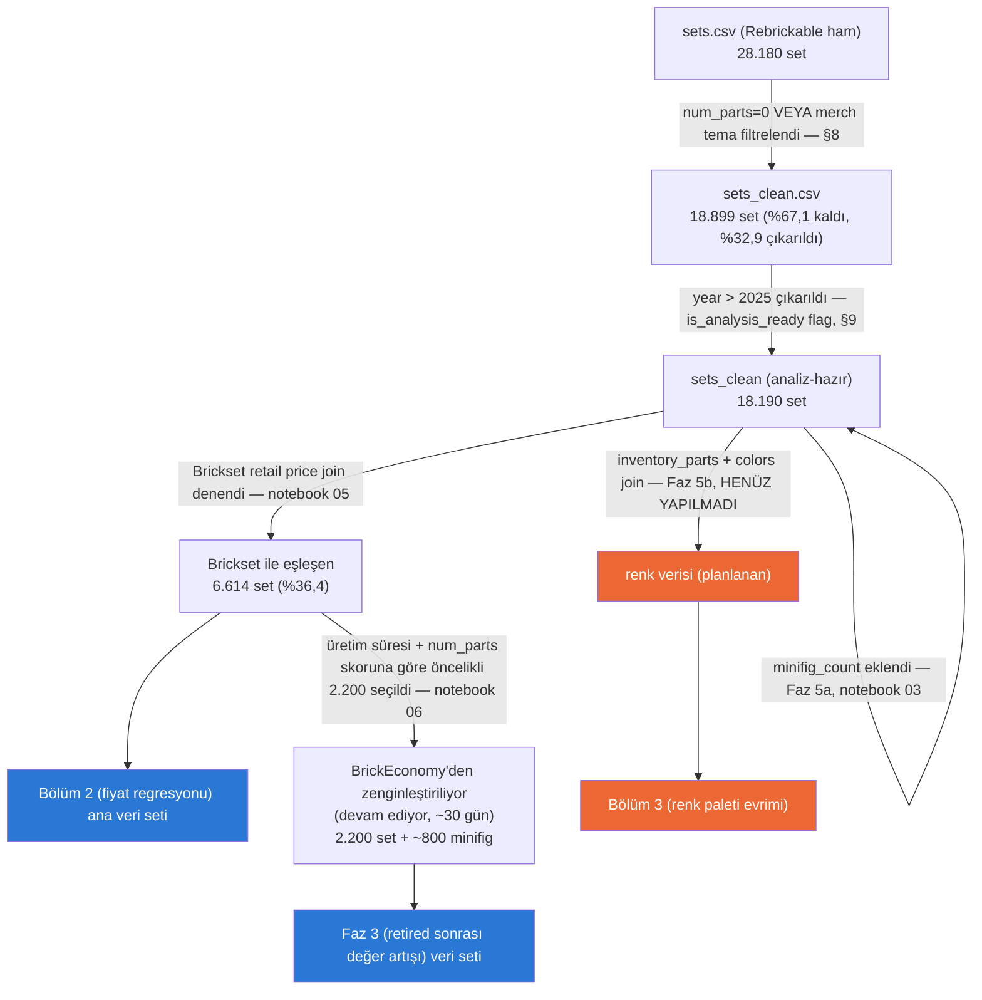

# Proje Haritası

**Son güncelleme: 2026-09-08** — Bölüm 1 (karmaşıklık trendi) tamamlandı,
Bölüm 2 (fiyat regresyonu) için veri hazır ama modelleme henüz başlamadı,
BrickEconomy çekimi ~81/2.200 tamamlandı (devam ediyor, ~30 günlük süreç).

## Veri akışı

## Bugün nerede kaldık

- **Bölüm 1 (karmaşıklık trendi):** Tamamlandı.
- **Bölüm 2 (fiyat regresyonu):** Veri seti hazır (Brickset, n=6.614) ama
  eşleşme yanlılığı (2015 sonrasına ve büyük/flagship setlere yığılma)
  dokümante edildi (notebook 05, DATA_SOURCES.md) — modelleme henüz
  başlamadı.
- **Bölüm 3 (renk paleti evrimi):** Henüz başlamadı — Faz 5b (inventory_parts
  + colors join) bekliyor.
- **Bölüm 4 (tema ömrü/başarı):** Henüz başlamadı.
- **Faz 3 (retired sonrası değer artışı, BrickEconomy):** Çekim sürüyor —
  günlük 100/dakikada 4 istek limiti nedeniyle resumable, kendi kendini
  günlük ~90 çağrıda durduran bir script ile ~30 güne yayılmış durumda.
  Bugünkü ilerleme: ~81/2.200 set (+ ~800 minifig kotası, setler bitince
  başlayacak).
