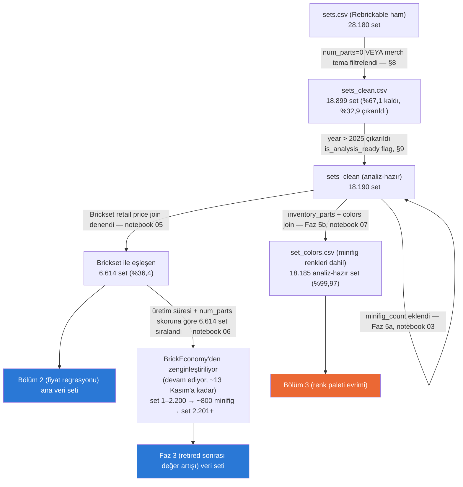

# Proje Haritası

**Son güncelleme: 2026-09-13** — Bölüm 1 (karmaşıklık trendi) tamamlandı,
Bölüm 2 (fiyat regresyonu) için veri hazır ama modelleme henüz başlamadı.
BrickEconomy çekimi launchd ile otomatikleşti (günde 100 istek) ve hedef
6.614 setin tamamına genişletildi: 187/2.200 set çekildi, üyelik ~13 Kasım
2026'da bitiyor.

## Veri akışı

## Bugün nerede kaldık

- **Bölüm 1 (karmaşıklık trendi):** Tamamlandı.
- **Bölüm 2 (fiyat regresyonu):** Veri seti hazır (Brickset, n=6.614) ama
  eşleşme yanlılığı (2015 sonrasına ve büyük/flagship setlere yığılma)
  dokümante edildi (notebook 05, DATA_SOURCES.md) — modelleme henüz
  başlamadı.
- **Bölüm 3 (renk paleti evrimi):** Henüz başlamadı — veri hazır (Faz 5b,
  `set_colors.csv`, minifig renkleri dahil, tamamlandı). Erken sağlık kontrolü:
  renk çeşitliliği set büyüklüğünden bağımsız olarak zamanla artıyor (Spearman
  ρ = 0,48 genel; büyüklük dilimleri içinde 0,37 / 0,56 / 0,54), bkz. notebook 07.
- **Bölüm 4 (tema ömrü/başarı):** Henüz başlamadı.
- **Faz 3 (retired sonrası değer artışı, BrickEconomy):** Çekim sürüyor ve
  otomatik — launchd (`scripts/launchd/com.brickbybrick.fetch.plist`) her gün
  10:00'da `scripts/fetch_brickeconomy_daily.py`'yi çalıştırıyor, günlük 100
  istek kotasını kullanıyor, ardından projeyi Google Drive'a
  (`brick_by_brick/proje_yedek`) yedekliyor. HTTP 400 alan kodlar
  (`_skip_http400.json`, şu an sadece `2000409-2`) bir daha denenmiyor.
  - **Plan (üyelik ~13 Kasım 2026'ya kadar, ~6.000 istek):** set 1–2.200
    (~4 Ekim'e kadar) → ~800 minifig (~12 Ekim) → set 2.201–6.614 (üyelik
    bitene kadar, ~3.200 set). Beklenen toplam: ~5.400 set + 800 minifig —
    Mac kapalı geçen her gün ~100 set eksiltir.
  - **Dikkat:** 2.200 sonrası setler seçim mantığı gereği farklı bir profil
    taşıyor (medyan ~140 parça, medyan yıl 2016); analizlerde sıra dilimi
    ayrı bir değişken olarak tutulmalı (notebook 06, bölüm 5).
  - İlerleme: 187/2.200 set (2026-09-13).
