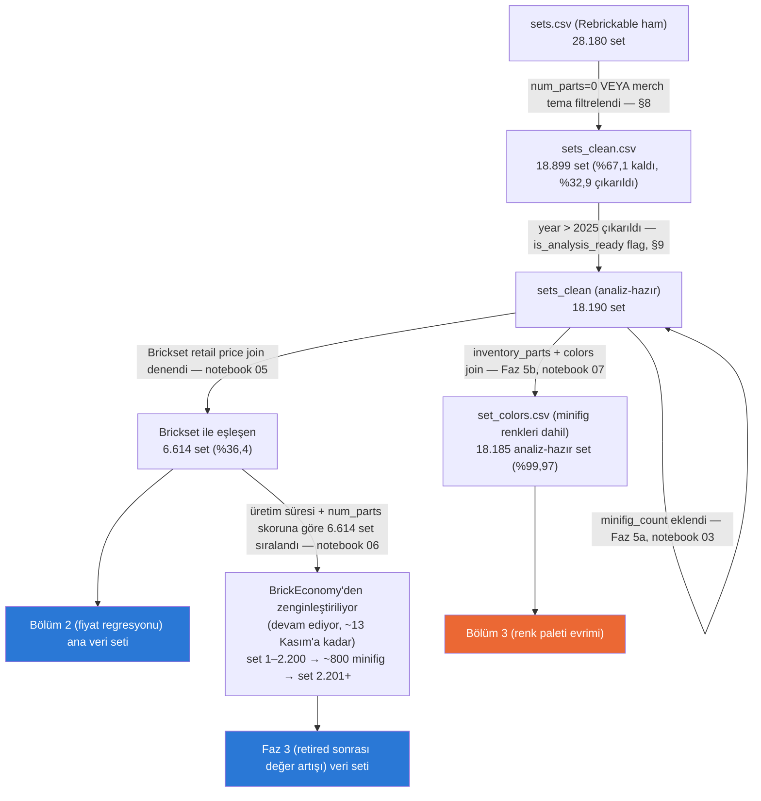

# Proje Haritası

**Son güncelleme: 2026-09-13** — Bölüm 1 (karmaşıklık trendi) tamamlandı,
Bölüm 2 (fiyat regresyonu) EDA'sı tamamlandı (notebook 08), modelleme henüz başlamadı.
BrickEconomy çekimi launchd ile otomatikleşti (günde 100 istek) ve hedef
6.614 setin tamamına genişletildi: 187/2.200 set çekildi, üyelik ~13 Kasım
2026'da bitiyor.

## Veri akışı

## Bugün nerede kaldık

- **Bölüm 1 (karmaşıklık trendi):** Tamamlandı.
- **Bölüm 2 (fiyat regresyonu):** Veri seti hazır (Brickset, n=6.614; eşleşme
  yanlılığı notebook 05 ve DATA_SOURCES.md'de). **EDA tamamlandı (notebook 08)**,
  modelleme henüz başlamadı. Öne çıkanlar: hedef log(fiyat); en güçlü değişken
  log(num_parts) (Spearman 0,85); n_unique_colors orta (0,64, VIF < 3); premium
  primi büyük setlerde; minifig_count ve year zayıf. 2024–2025 test seti sayıca
  yeterli (886) ama daha büyük setlere kaymış → önerilen bölme ≤2022 / 2023–2025
  + genişleyen pencereli doğrulama. `theme_tier`'ın güncelliği sorgulandı (notebook
  08 §8): Duplo setleri yanlış grupta, `other` değer hatlarıyla lisanslı temaları
  karıştırıyor, Technic premium gibi fiyatlanmıyor. Kök temaya dayalı 5 kategorili
  şema önerildi — **karar bekleniyor**, `theme_tier` henüz değiştirilmedi.
- **Bölüm 3 (renk paleti evrimi):** Henüz başlamadı — veri hazır (Faz 5b,
  `set_colors.csv`, minifig renkleri dahil, tamamlandı). Erken sağlık kontrolü:
  renk çeşitliliği set büyüklüğünden bağımsız olarak zamanla artıyor (Spearman
  ρ = 0,48 genel; büyüklük dilimleri içinde 0,37 / 0,56 / 0,54), bkz. notebook 07.
- **Bölüm 4 (tema ömrü/başarı):** Henüz başlamadı.
- **Faz 3 (retired sonrası değer artışı, BrickEconomy):** Çekim sürüyor ve
  otomatik — launchd (`scripts/launchd/com.brickbybrick.fetch.plist`) her gün
  10:00'da `scripts/fetch_brickeconomy_daily.py`'yi çalıştırıyor, günlük 100
  istek kotasını kullanıyor, ardından projeyi Google Drive'a
  (`brick_by_brick/proje_yedek`) yedekliyor. HTTP 400 alan kodlar
  (`_skip_http400.json`, şu an sadece `2000409-2`) bir daha denenmiyor.
  - **Plan (üyelik ~13 Kasım 2026'ya kadar, ~6.000 istek):** set 1–2.200
    (~4 Ekim'e kadar) → ~800 minifig (~12 Ekim) → set 2.201–6.614 (üyelik
    bitene kadar, ~3.200 set). Beklenen toplam: ~5.400 set + 800 minifig —
    Mac kapalı geçen her gün ~100 set eksiltir.
  - **Dikkat:** 2.200 sonrası setler seçim mantığı gereği farklı bir profil
    taşıyor (medyan ~140 parça, medyan yıl 2016); analizlerde sıra dilimi
    ayrı bir değişken olarak tutulmalı (notebook 06, bölüm 5).
  - İlerleme: 187/2.200 set (2026-09-13).

## Bilinen açık noktalar / sıradaki iş

- **Bölüm 1 (notebook 04) tema kırılımı `theme_name` bazlı — tekillik sorunundan kısmen etkilenmiş**
  (sorun notebook 08 §8'de bulundu; henüz düzeltilmedi, proje devam ettiğinde düzeltilecek). 04 hiç `theme_id`
  kullanmıyor; aynı adı taşıyan farklı `theme_id`'ler birleşiyor (analiz-hazır sette 48 isim, 7.169 set; sıralamaya
  giren 81 temanın 26'sı).
  - **Sağlam:** premium listesinden UCS, Architecture, Modular Buildings, LEGO Ideas, Creator Expert tek `theme_id` —
    büyüme rakamları doğru.
  - **Etkilenen — `Technic`:** 4 `theme_id` birleşmiş (ana Technic + 2 `Service Packs` + `Educational and Dacta`).
    İlk 5 yıl medyanı 4,5 parça yedek parça paketlerinden geliyor; ana Technic hattı (id 1) tek başına 1983–87'de
    258 → 2021–25'te 672 parça, **fark +414** (raporlanan +667,5; §5'teki elle filtre +652). Hâlâ hızlı büyüyen bir
    tema, ama büyüme ~%40 abartılmış — premium ataması için bir gerekçe daha zayıflıyor (bkz. 08 §8).
  - **Etkilenen — `Town Plan`** (hızlı listede 8.): +361 tamamen birleştirme artefaktı; `theme_id` bazında iki
    kayıt da pencere örtüşmesi nedeniyle sıralamaya hiç girmiyor.
  - **Etkilenen ama sonuç değişmiyor — `Police`** (durağan listede): +6, 1972–77 Legoland Police ile 2021–25 City
    Police'in karışımı; City Police tek başına 2005–09 → 2021–25 **−5**, yine durağan.
  - `Ninjago`, `Friends`, `City` küçük alt temalarla birleşmiş, etkisi küçük (City −13 → ana hat +10).
